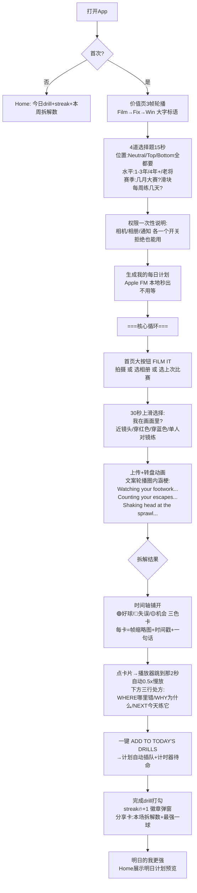
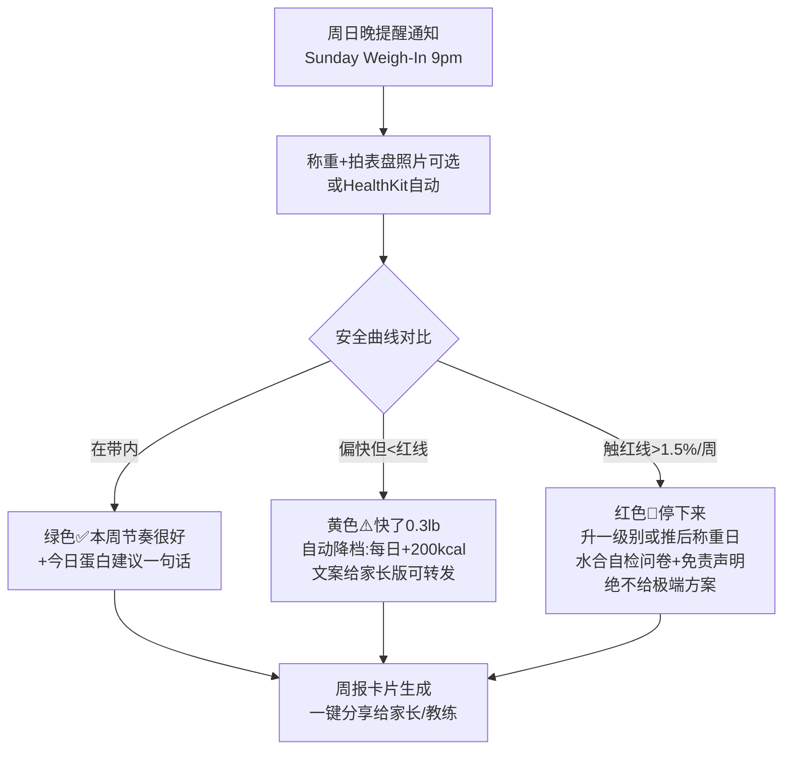
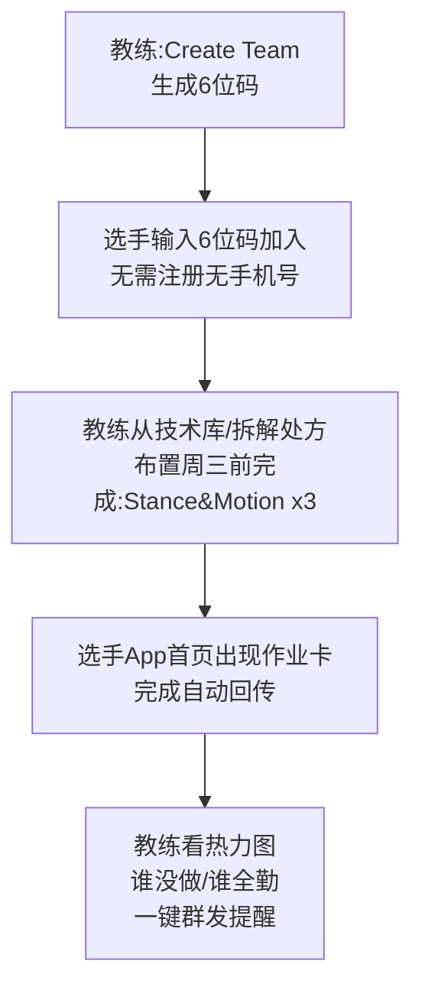
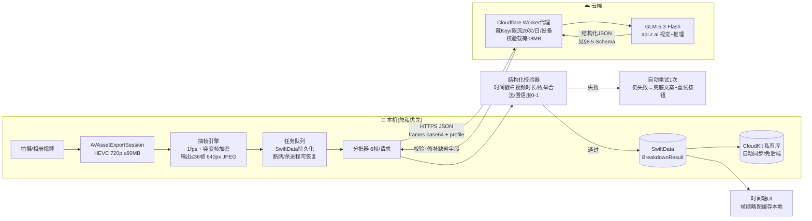
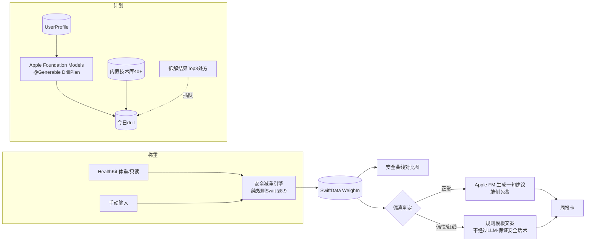

# TR-20260917-摔角AI-操作指南

> **文档目的**：让任何 LLM / 开发者拿着本文档即可复刻出一款在功能、UI、易用性、定价上全面碾压竞品 **Wrestle AI** 的美国市场 iOS 摔角训练 App。
> **文档日期**：2026-09-17 ｜ **目标市场**：美国（App Store 美区） ｜ **技术栈**：SwiftUI + Apple Foundation Models + GLM-5.3-Flash (Z.ai)
> **需求映射**：竞品研究=§1-2 ｜ 思维工具分析=§3 ｜ 痛点skill=§2 ｜ GitHub二开=§8.11 ｜ 实现流程图=§5 ｜ 用户流程图=§6 ｜ 数据流图=§7 ｜ 代码示例=§8 ｜ Apple AI+GLM组合=§8.2-8.7 ｜ 价格策略=§9 ｜ UI规范=§10 ｜ 命名=§0

---

# §0 APP 命名与副标题（最高优先级）

## 0.1 定案

| 项目 | 内容 |
|---|---|
| **APP 名称** | **Takedown IQ** |
| **App Store 副标题**（≤30字符） | **AI Wrestling Coach & Film**（25字符） |
| **一句话定位**（商店推广文本） | Film your match. Get the exact 2 seconds you lost — and the drill that fixes it.（拍下比赛，找到你输掉的那两秒，附上修好它的训练处方） |
| **类别** | Sports（主）+ Health & Fitness（辅） |
| **年龄分级** | 13+（含体重管理内容） |

## 0.2 命名调研结论（2026-09-17 已验证）

**验证记录**：Google/WebSearch 全网检索 "Takedown IQ"，未发现 App Store 存在同名应用；"Wrestle AI"、"WrestleKit"、"SportsReflector"、"Greco AI"、"MatBoss"、"MatIQ"（已有同名 BJJ 应用 matiqbjj.xyz，**禁止使用**）均已确认被占用或高风险。提交 App Store Connect 前需用名称可用性检查再复核一次。

**五维度命名分析**：

| 维度 | 分析 | 得分 |
|---|---|---|
| **ASO 搜索优化** | "takedown" 是美国摔角人群最高频搜索词之一（远高于 "wrestling training" 等泛词）；IQ 后缀承接 "wrestle IQ / mat IQ / takedown IQ" 这个圈内真实黑话（MMA 解说、摔角播客高频用语），天然命中学生与教练的搜索习惯——沿用 Sober Tracker 验证过的"意图式命名"方法论 | 9/10 |
| **品牌记忆度（最关键）** | 两个短硬音节 + IQ 收尾，口播顺滑（"you need Takedown IQ, bro"天然成为 TikTok 评论区梗）；摔角术语 + 智力词的组合在圈内自带传播梗属性，用户会主动用名字夸人/损人 | 9/10 |
| **功能描述性** | 一眼可知 = 让你更会摔角（takedown 是摔角最核心得分技术），无需解释 | 9/10 |
| **情感共鸣** | IQ 直击"输在脑子不在力气"的挫败感；对 14-18 岁男性用户群，"提高 IQ" 比 "get better" 更有挑衅性和自我提升冲动 | 8/10 |
| **国际化适配** | 无俚语歧义、无宗教/文化敏感；"takedown" 在英语圈通用（folkstyle/freestyle/BJJ/MMA 都用） | 9/10 |

**备选名**（若主名注册受阻，按序启用）：
1. **Sudden Victory**——摔角加时赛规则术语（"sudden victory overtime"），情绪价值极高（绝杀时刻），已验证无同名 App（注意与 suddenvictorycustoms.com 运动服饰店不同品类，商标风险低但仍建议律师复核）
2. **MatEdge**——垫上优势，简短品牌感强
3. **RideTime**——骑乘时间（摔角专属统计项），圈内人秒懂

**ASO 关键词字段**（100字符内，美区）：`wrestling,drills,takedown,pin,mat,coach,film,folkstyle,freestyle,grappling,streak,match`（"wrestling coach"是月搜索量最大的短语，副标题已覆盖，关键词字段不重复堆砌）

**图标建议**：黑色背景 + 荧光绿（volt #C8FF2E）单线勾勒的双腿抱摔剪影 + IQ 角标；黑暗健身房环境中一眼可辨（详见 §10）。

---

# §1 竞品真相校准（复刻前必读）

## 1.1 重要更正：Wrestle AI 的真实形态

原商机调查报告（TR-20260915）将 #14 Wrestle AI 描述为"WWE/AEW 摔角粉丝的剧情预测/幻想联盟应用"。**经深挖官方商店页与创始人访谈，这是误写**。真实产品：

| 维度 | 真实情况（已核实） |
|---|---|
| 产品本质 | **业余摔角训练 App**（folkstyle/freestyle），不是 WWE 粉丝应用 |
| 创始人 | George Lampropoulos（19岁大学生，零代码基础，Rork 拖拽生成） |
| 战绩 | 6个月 $131,863 总收入，MRR $23K（含年费摊销月流水 $39.4K），4.8★ / 1.7K 评分，100K+ 下载，总成本约 $1,100 |
| 核心功能 | ① 上传比赛/训练视频 → AI 逐条反馈（stance/setup/finish/chain wrestling）② 个性化每日 drill 计划（neutral/top/bottom 三位置）③ 技术库 ④ "Impossible Mode" 短时高强度挑战 ⑤ 数据统计（attempts/finishes/riding time/escapes/pins）⑥ 计时工具 ⑦ 体能训练 ⑧ streak 打卡 |
| 技术栈 | Rork (React Native) + Supabase + OpenAI 视觉 API；月成本 <$150 |
| 定价 | $9.99/月 或 $59.99/年；**3天免费试用只挂在年费上**（诱导年费的经典结构） |
| 增长打法 | 摔角网红合伙人预售 3000-4000 单 → 上线日 App Store 分类榜 #18 → 每天私信 100 个摔角创作者（$2-5 CPM 结算）→ VA 外包私信 → onboarding 长流程做沉没成本推过付费墙 |

> **对我们的意义**：市场已被验证（家长+青少年摔角手真实付费），但产品本身是一个 6 周赶出来的 MVP——这正是可以碾压的窗口期。

## 1.2 竞品矩阵（2026-09 实况）

| 竞品 | 定位 | 定价 | 致命弱点 |
|---|---|---|---|
| **Wrestle AI**（复刻对象） | 个人训练 AI 教练 | $9.99/月，$59.99/年，仅年费3天试用 | 无免费层；RN跨端手感一般；AI反馈泛泛不挂时间戳；无体重管理；无教练闭环 |
| **WrestleKit** | 同类模仿品 | 周/年订阅 | 同上，且更弱 |
| **SportsReflector** | 通用22+运动实时CV+AR | 免费+Pro | 泛运动通用模型，摔角深度不足；无摔角规则知识 |
| **Greco AI** | 希腊罗马式垂类 | 周/年/终身 | 只覆盖 Greco，美国主流是 folkstyle |
| **MatBoss 11.0** | 全队平台（录像+统计+体重+队务） | 团队订阅（贵） | 面向教练团队，个人选手用不起；Reddit 用户抱怨价格 |
| **TrackWrestling / Flo** | 赛事/直播基础设施 | $150/年 | Reddit 原话："interface is objectively bad"；无API封闭 |
| **Hudl** | 学校统一采购录像平台 | 按队收费 | 个人用不到；摔角非重点 |

## 1.3 市场规模

- 美国高中摔角注册选手约 **25万+男生 + 2.5万+女生**（NFHS，女生摔角是全美增长最快运动之一），加上 youth club / NCAA / JUCO，可触达人群 **40万+**
- 家长是真实付款人：青少年体育家庭年均运动支出 $1,000+（装备/营/私教），$49.99/年只占 5%
- 赛季周期性强：11月-2月主赛季（=最大流量与付费窗口），7-9月休赛期技术营（第二窗口）

---

# §2 痛点清单（pain-point-hunter 产出）

> 方法：Reddit r/wrestling、r/Parenting、App Store 评论、创始人访谈交叉验证。评分维度：具体性25% / 独特性20% / 可实现性20% / 付费性20% / 市场规模15%。

| # | 痛点 | 证据（用户原话/事实） | 影响 | 级别 |
|---|---|---|---|---|
| **P1** | **AI 反馈泛泛、不挂时间戳、装准不坦白**——"哪里都能挑出毛病"式反馈对选手无用 | Reddit 帖《Any need for an AI match analyzer?》下社区对"AI能不能真看懂摔角"普遍怀疑；Cal AI 因"识别不准还装准"被 Apple 下架（同类目前车之鉴） | 用户付费一次后流失 | 🥇88 |
| **P2** | **定价信任危机**：无免费层、试用只挂年费、长 onboarding 沉没成本逼付费；付款人是家长 | Wrestle AI 商店页明示仅年费含试用；行业差评第一大来源=欺骗性订阅（TR-20260915 全局结论#3） | 差评+退款+家长警惕 | 🥇86 |
| **P3** | **拍摄与上传摩擦**：训练馆/赛场家长手机竖拍、30秒内找不到"哪个是我"、视频太大传不动 | WrestleKit 专门做了"说明你穿哪个颜色"功能（侧面证明该摩擦真实存在） | 核心功能使用率低 | 🥇82 |
| **P4** | **减重焦虑与安全**：家长恐慌（Reddit r/Parenting"看着孩子们没水喝跑圈饿肚子"）、NWCA 水合测试新规、1.5%/周减重红线；MatBoss 11.0 刚加体重追踪（大厂用脚投票验证了需求）；**所有 AI 训练竞品均无此功能** | Reddit 多帖：减重争议贯穿 r/wrestling 十年；PNL 青少年赛新规上线水合检测 | 家长付款的钩子+品牌社会责任 | 💎91 |
| **P5** | **生涯战绩/里程碑难管理**：TrackWrestling UI 烂且无 API；"50胜里程碑"类小应用出现（需求真实） | Reddit《Track Wrestling API?》："doing a disservice to customers, their interface is objectively bad" | 留存钩子 | 🥈75 |
| **P6** | **教练闭环缺失**：教练想布置"位置专项作业"并看完成度；MatBoss 贵到个人教练用不起 | MatBoss 11.0 全队功能清单（作业/出勤/消息）= 教练需求真实；但个人教练层空白 | B端杠杆：一个教练=30个学生 | 🥇80 |
| **P7** | **新手入坑劝退**：14岁新人发帖"我该坚持还是退队"——基础技术路径无人引导 | Reddit《I'm 14 and completely new to wrestling》高热度 | 转化漏斗入口 | 🥈72 |
| **P8** | **招募集锦刚需**：大学招募要 highlight reel + 数据，现需 MatBoss/Hudl 团队权限才能导出 | MatBoss"recruiting got faster"官方博客=需求被官方承认 | 付费升级强动机 | 🥈74 |

**结论**：竞品只在 P3 上做了浅层修补，P1/P2/P4/P6 完全空白。我们的产品 = **修好 P1/P2（可信反馈+透明定价）守住基本盘，用 P4（安全减重）+ P6（教练闭环）做出竞品没有的付费理由**。

---

# §3 产品定位与碾压策略（sequential-thinking 结构化结论）

## 3.1 一句话定位

**Takedown IQ = 会"指着画面说话"的摔角私教 + 让家长放心的安全减重管家，免费层真实可用，付费明码标价。**

## 3.2 破局三刀

| 刀 | 打击点 | 具体做法 |
|---|---|---|
| **刀1：可信反馈（打 P1）** | 竞品"AI泛泛而谈装准" | 每条反馈强制结构化：**时间戳 + 关键帧缩略图 + 置信度(高中低) + 三行处方**（哪里错/为什么/今天练这个）。置信度<0.6 时 App **坦白说"这个角度我看不清，下次请把手机放低45°"**，并给出拍摄引导——把"装准"变成"坦诚+教学"，这本身就是 App Store 截图上的差异化卖点 |
| **刀2：信任定价（打 P2）** | 竞品"无免费层+年费陷阱" | 免费层**真有用**（每日1次完整视频拆解+全技术库+drill打卡+战绩本）；商店页+App内公开价格页；取消路径在设置页一级入口（"Cancel in 2 taps"写进宣传语） |
| **刀3：安全减重（打 P4，独占）** | 竞品完全没有，家长却是付款人 | NWCA 式安全减重引擎：体重轨迹 vs 安全曲线（≤1%/周）、水合自检问卷、降速/升级建议、**硬性黑名单**（绝不输出断水/桑拿/催吐/绝食类建议，规则引擎拦截+免责声明）。家长视角文案："We coach the cut, not the crash." |

## 3.3 碾压对照表（写进 App Store 副文案/落地页）

| 能力 | Wrestle AI | **Takedown IQ** |
|---|---|---|
| 免费层 | 无（仅3天试用挂年费） | **每日1次完整拆解+全技术库+打卡** |
| AI 反馈颗粒度 | 文字泛述 | **时间戳+帧截图+置信度+drill处方** |
| 看不清时 | 装准 | **坦白+拍摄引导（可信度营销点）** |
| 安全减重 | 无 | **独有引擎（家长买单钩子）** |
| 教练作业闭环 | 无 | **队伍码+作业+完成热力图** |
| 招募集锦导出 | 无 | **一键导出（Pro）** |
| 年费 | $59.99（3天试用） | **$49.99（7天试用）+ 赛季Pass $19.99/90天** |
| 价格透明 | 商店页模糊 | **公开价格页+2步取消** |
| 技术底座 | React Native | **SwiftUI 原生 + 端侧 Apple AI（离线可用）** |

---

# §4 功能规格

## 4.1 MVP（6周）

| 模块 | 功能 | 输入 | 输出 | 边界/降级 |
|---|---|---|---|---|
| **Film Breakdown 视频拆解** | 拍摄/相册选取 ≤3min 视频 → 抽帧 → GLM-5.3-Flash 视觉分析 → 时间轴事件卡 | 视频文件 + 可选"我在画面里的特征"（红裤/近镜头） | 事件列表：{t, 类型(进攻/防守/失误/好球), 标题, 三行处方, 置信度, 关键帧} + 本场总评 + 推荐drill | 置信度<0.6 → 显示"看不清"卡+拍摄引导；断网 → 排队重试 |
| **Drill Plan 每日计划** | 按位置/水平/赛季日期生成每日 15-20min drill 单 | onboarding 4题（位置/水平/赛季/每周天数） | 今日drill清单（可勾选）+ 计时器 | 生成用 Apple FM（免费无限），失败→内置模板库兜底 |
| **Technique Library 技术库** | 40+ 条 folkstyle 核心技术卡（文字步骤+要点+常见错误），可搜可藏 | — | 阅读卡 | 全量内置，离线可用，全用户免费 |
| **Match Log 战绩本** | 手输/快速记 比赛结果（胜/负/技术分/pin）+ 生涯里程碑（50胜徽章） | 比赛结果 | 生涯统计页+徽章墙 | 本地+CloudKit同步 |
| **Safe Cut 安全减重** | 设目标级别+称重日 → 每日晨称 → 安全曲线对比 → 偏快自动降档 | 体重(手输/HealthKit)+水合自检 | 曲线图+当日建议文案+家长可读周报 | 偏离红线→红色警告；绝不输出极端建议（规则引擎） |
| **Coach Chat AI教练** | 文字问答（"我的趴防老被起身怎么办"） | 问题+用户档案上下文 | Apple FM 生成回答（免费层5次/天，Pro无限） | iOS<18.1 降级为关键词检索技术库 |
| **Streak/激励** | 打卡streak、周报摘要、里程碑推送 | 行为数据 | 本地通知+首页streak火焰 | 纯本地 |

## 4.2 V1.1（上线后4周内）

- Coach Mode：6位队伍码（CloudKit sharing）→ 布置drill作业 → 团队完成热力图（打 P6）
- Recruiting Reel：多场高光事件自动剪辑导出带水印集锦（Pro，打 P8）
- Newbie Path：7天新手路径（打 P7，复用技术库+每日计划）
- Apple Watch：drill 计时器 + 快速记分

---

# §5 实现流程图（开发实现顺序）

```mermaid
flowchart TD
    A[W0 准备<br/>Apple Developer账号/Xcode 16+<br/>GLM API Key(Z.ai) + Cloudflare账号] --> B[W1 骨架<br/>SwiftUI工程+iOS17目标<br/>SwiftData模型+CloudKit容器<br/>Tab框架:Home/Film/Plan/Stats/Profile]
    B --> C[W1-2 视频管线<br/>PhotosPicker/AVCaptureSession<br/>AVAssetExportSession压缩HEVC<br/>AVAssetImageGenerator抽帧]
    C --> D{抽帧跑通?}
    D -- 否 --> C
    D -- 是 --> E[W2 AI管线<br/>Cloudflare Worker代理部署<br/>GLMClientSwift+结构化JSON解析<br/>置信度门控+重试]
    E --> F{端到端拆解跑通?}
    F -- 否 --> E
    F -- 是 --> G[W3 结果体验<br/>时间轴事件卡+帧跳转播放器<br/>drill一键入计划+streak]
    G --> H[W3-4 免费层闭环<br/>每日1次额度引擎<br/>技术库40+卡<br/>战绩本+徽章]
    H --> I[W4 减重引擎<br/>称重流+安全曲线<br/>规则引擎+黑名单拦截<br/>HealthKit只读接入]
    I --> J[W5 变现<br/>StoreKit2商品配置<br/>付费墙页(公开价格页)<br/>恢复购买+2步取消指引]
    J --> K[W5-6 打磨提审<br/>Apple FM Coach Chat<br/>通知/深链/无障碍<br/>隐私标签+审核备注]
    K --> L{TestFlight内测<br/>≥20名真实摔角家庭}
    L -- 反馈回炉 --> G
    L -- 通过 --> M[提审+预购页<br/>同步启动网红私信]
```

**关键工程规则**
1. **免费额度服务端不存用户体系**：额度记在设备 `UserDefaults+CloudKit`（匿名），防刷用 Worker 层 IP+设备指纹软限——零后端账号 = 零合规负担
2. **AI 全部异步队列化**：拆解任务入本地队列，失败可重试，App 被杀后恢复
3. **任何 AI 输出都必须过"结构化校验器"**：JSON 缺字段/时间戳越界 → 自动降级重试1次 → 仍失败显示兜底文案，**绝不展示半残数据**
4. 一切文案英文美式；体重单位按用户设置 lb/kg

---

# §6 用户使用流程图（极端重要：30秒上手 + 爽文体验）

## 6.1 首启动（目标：120秒内看到第一次AI拆解）



## 6.2 每周称重（家长安心流）



## 6.3 教练流（V1.1）



**爽感设计守则**（对齐"看爽文小说"目标）：
1. **3秒原则**——任何页面 3 秒内必须有"看得懂的爽点"（大数字/进度/火焰/徽章），不堆专业图表
2. **处方可执行**——每条 AI 输出必落到一个"今天能做的动作"，禁止"多注意脚步"这种废话（对应 P1）
3. **进度可见**——拆解次数、修正率（标记为"已修复"的失误占比）、streak、徽章四件套常驻首页
4. **梗文化**——空状态文案用圈内梗（"Even the ref needs a break."），社交分享卡自带病毒属性

---

# §7 软件数据流图（极端重要：合理、防错、真实解决问题）

## 7.1 主数据流：视频拆解



**防错规则（数据真实性的命门）**：
1. **时间戳锚定**：每帧携带 `t = 提取时刻偏移`，AI 返回的事件只允许挂到"送入的帧集合"的时间戳上 → 模型幻觉出帧外时间 = 校验器直接丢弃
2. **置信度门控**：`confidence < 0.6` 的事件转成"看不清卡"（诚实降级），不伪装成结论
3. **两阶段合并**：先按帧出"观察"，再一次 GLM 纯文本调用把观察聚合成"本场总结+Top3处方"（避免长视频单次上下文过载）
4. **视频不留存云端**：Worker 只收帧不收视频；本地视频用户可一键删除（App Store 隐私标签目标："Data Not Collected"）

## 7.2 副数据流：减重与计划



## 7.3 存储与同步总表

| 数据 | 位置 | 同步 | 说明 |
|---|---|---|---|
| 视频/帧缩略图 | 本机 Documents + Caches | 不同步 | 用户可删；云端不留 |
| 拆解结果/战绩/称重/计划 | SwiftData → CloudKit 私有库 | 自动 | 换机无痛迁移（碾压竞品"无云同步"） |
| 用户档案(匿名) | CloudKit | 自动 | 无邮箱注册、无手机号 |
| 免费额度计数 | 本地 + CloudKit | 自动 | 删App重装按设备指纹在Worker侧仍软限 |
| GLM Key | 仅 Worker 环境变量 | — | 永不出现在客户端 |

---

# §8 核心技术实现代码示例与编写规则

## 8.0 架构总览

```
TakedownIQ (SwiftUI, iOS 17+)
├── App/                 # 入口、Tab、路由
├── Features/
│   ├── Film/            # 拍摄、抽帧、结果时间轴、播放器
│   ├── Plan/            # 每日drill、计时器、streak
│   ├── Weight/          # 称重、安全曲线、周报
│   ├── Library/         # 技术库(内置JSON)
│   ├── Stats/           # 战绩本、徽章
│   └── Paywall/         # StoreKit2
├── Core/
│   ├── AI/              # GLMClient / AppleAICoach / 校验器
│   ├── Video/           # 抽帧/压缩
│   ├── Models/          # SwiftData @Model
│   └── Sync/            # CloudKit
└── Proxy/               # Cloudflare Worker(独立部署)
```

## 8.1 关键 Swift 编写规则（给复刻 LLM 的硬约束）

1. 严格 SwiftUI + `async/await`；不用第三方网络库（URLSession 足够）
2. 所有 AI 调用必须：可取消（`Task.cancel`）→ 有 8s 心跳超时 → 失败可重试 → 结果过校验器才落库
3. 视频帧处理放后台 `Task.detached`，主线程只碰 UI
4. 金额/单位用 `Decimal`/`Measurement`；日期用 `Calendar.current` 美区时区
5. 每个功能先写"降级路径"再写"理想路径"（Apple FM 不可用→模板；GLM 不可用→排队）

## 8.2 GLM 代理（Cloudflare Worker，部署即用）

```javascript
// proxy/worker.js — 部署: npx wrangler deploy
// 作用: 藏Key、限流、裁剪载荷。GLM兼容OpenAI格式, 端点 api.z.ai
export default {
  async fetch(request, env) {
    if (request.method !== "POST") return new Response("Method Not Allowed", { status: 405 });

    // 1) 轻量防滥用: 设备指纹 + IP, KV 计数, 免费层软限 20 次/日
    const fp = request.headers.get("X-Device-ID") || "";
    const ip = request.headers.get("CF-Connecting-IP") || "";
    const day = new Date().toISOString().slice(0, 10);
    const key = `q:${day}:${fp || ip}`;
    const count = Number((await env.KV.get(key)) || 0);
    if (count >= 25) return json({ error: "daily_limit" }, 429);
    await env.KV.put(key, String(count + 1), { expirationTtl: 86400 });

    // 2) 载荷校验: 只允许 frames 数组 + 上下文, 最大 8MB
    const body = await request.json();
    const frames = body?.frames;
    if (!Array.isArray(frames) || frames.length === 0 || frames.length > 6)
      return json({ error: "bad_frames" }, 400);
    if (JSON.stringify(body).length > 8_000_000) return json({ error: "too_large" }, 413);

    // 3) 转发 GLM-5.3-Flash (国际版端点, 双平台Key通用)
    const upstream = await fetch("https://api.z.ai/api/paas/v4/chat/completions", {
      method: "POST",
      headers: {
        "Authorization": `Bearer ${env.GLM_API_KEY}`,
        "Content-Type": "application/json",
      },
      body: JSON.stringify({
        model: "glm-5.3-flash",           // 以智谱控制台可用模型ID为准
        messages: [{ role: "user", content: body.content }],
        temperature: 0.2,                  // 分析类任务低温
        max_tokens: 2000,
        response_format: { type: "json_object" }, // 若模型不支持则去掉并在提示词强制纯JSON
      }),
    });
    const data = await upstream.json();
    return json(data, upstream.status);
  },
};

function json(obj, status) {
  return new Response(JSON.stringify(obj), {
    status, headers: { "content-type": "application/json" },
  });
}
```

```toml
# proxy/wrangler.toml
name = "tdiq-glm-proxy"
main = "worker.js"
compatibility_date = "2026-09-01"
[[kv_namespaces]]
binding = "KV"
id = "<your-kv-id>"
# Secret: npx wrangler secret put GLM_API_KEY
```

## 8.3 Swift GLM 客户端（视觉拆解）

```swift
import Foundation

struct BreakdownRequest: Encodable {
    let frames: [String]                 // base64 JPEG, ≤6张
    let content: String                  // 组装好的提示词+帧引用
    let context: [String: String]        // level/position/weeks_to_event
}

struct FrameShot: Identifiable, Codable {
    let id: UUID
    let t: Double                        // 秒, 本地锚定, 不信任模型自报时间
    let jpegData: Data
}

actor GLMClient {
    static let shared = GLMClient()
    private let endpoint = URL(string: "https://tdiq-glm-proxy.<you>.workers.dev/")!
    private let decoder = JSONDecoder()

    func analyze(batch: [FrameShot], profile: UserProfile) async throws -> [EventObservation] {
        var parts: [[String: Any]] = batch.map { frame in
            ["type": "image_url",
             "image_url": ["url": "data:image/jpeg;base64,\(frame.jpegData.base64EncodedString())"]]
        }
        parts.insert(["type": "text", "text": Self.prompt(profile: profile, frames: batch)], at: 0)

        var req = URLRequest(url: endpoint)
        req.httpMethod = "POST"
        req.timeoutInterval = 90
        req.setValue("application/json", forHTTPHeaderField: "Content-Type")
        req.setValue(AppState.deviceID, forHTTPHeaderField: "X-Device-ID")
        req.httpBody = try JSONSerialization.data(
            withJSONObject: ["frames": batch.map { _ in "" }, // 占位, Worker只验数量
                             "content": parts] )

        let (data, resp) = try await URLSession.shared.data(for: req)
        guard (resp as? HTTPURLResponse)?.statusCode == 200 else { throw AIError.upstream }
        return try Self.parseObservations(data, frames: batch)
    }

    /// 提示词编写规则(核心资产, 逐条执行):
    /// 1) 角色锁定: 美国高中/大学摔角教练视角, 只谈folkstyle/freestyle技术
    /// 2) 禁泛泛: 每条观察必须绑定 frame index (1..N), 拒绝"多注意脚步"式输出
    /// 3) 诚实优先: 看不清就 confidence<0.6 并写 "unclear"
    /// 4) 处方必须能在技术库匹配 drill_id, 匹配不到用 closest_drill
    /// 5) 输出纯JSON, 不说一句话废话
    static func prompt(profile: UserProfile, frames: [FrameShot]) -> String {
        let frameTimes = frames.map { "frame#\($0.id.uuidString.prefix(4)) t=\(String(format: "%.1f", $0.t))s" }
            .joined(separator: ", ")
        return """
        You are Coach TD, an elite American wrestling coach analyzing film for a
        \(profile.level.rawValue) wrestler (focus: \(profile.position.rawValue), folkstyle).
        Frames provided IN ORDER: \(frameTimes).
        For EVERY frame decide: is there a technique-relevant observation?
        Output STRICT JSON only:
        {"observations":[{"frame_index":1,"t":12.4,"kind":"mistake|good|chance",
          "title":"<=8 words","where":"<=12 words body part/position",
          "why":"<=20 words cause","drill_id":"<library_id|closest_drill>",
          "confidence":0.0,"unclear":false}],
         "summary":"<=30 words","top_drills":["drill_id","drill_id","drill_id"]}
        Rules: t must equal the given frame time. If the frame is ambiguous
        (facing away, cut off, motion blur) set unclear=true, confidence<=0.5.
        Never invent takedowns you cannot see. Wrestling terms only (setups,
        level change, penetration step, sprawl, stand-up, sit-out, tilt, cradle).
        """
    }

    static func parseObservations(_ payload: Data, frames: [FrameShot]) throws -> [EventObservation] {
        // 剥离 GLM 返回 choices[0].message.content → JSON → 校验
        struct Wrap: Decodable { let choices: [Choice] }
        struct Choice: Decodable { struct Msg: Decodable { let content: String }; let message: Msg }
        let wrap = try decoder.decode(Wrap.self, from: payload)
        guard let raw = wrap.choices.first?.message.content.data(using: .utf8) else { throw AIError.empty }
        struct Obs: Decodable {
            let frame_index: Int; let t: Double; let kind: String; let title: String
            let where_: String; let why: String; let drill_id: String
            let confidence: Double; let unclear: Bool?
            enum CodingKeys: String, CodingKey {
                case frame_index, t, kind, title; case where_ = "where"
                case why, drill_id, confidence, unclear
            }
        }
        struct Root: Decodable { let observations: [Obs]; let summary: String; let top_drills: [String] }
        let root = try decoder.decode(Root.self, from: raw)
        // 校验器: 时间戳必须命中送入帧的t(±0.05s), 枚举合法, 置信度夹取
        let validTimes = Set(frames.map { ($0.t * 10).rounded() })
        return root.observations.compactMap { o in
            guard validTimes.contains((o.t * 10).rounded()) else { return nil }
            guard ["mistake", "good", "chance"].contains(o.kind) else { return nil }
            return EventObservation(t: o.t, kind: EventKind(rawValue: o.kind) ?? .chance,
                                    title: o.title, where_: o.where_, why: o.why,
                                    drillID: o.drill_id,
                                    confidence: min(max(o.confidence, 0), 1),
                                    unclear: o.unclear ?? false)
        }
    }
}
```

## 8.4 抽帧引擎（AVFoundation）

```swift
import AVFoundation
import UIKit

enum FrameExtractor {
    /// 1fps 均匀抽帧 + 场景突变加密, 总数上限36, 输出640px JPEG
    static func extract(url: URL, maxFrames: Int = 36) async throws -> [FrameShot] {
        let asset = AVURLAsset(url: url)
        let duration = try await asset.load(.duration).seconds
        guard duration.isFinite, duration > 0 else { throw VideoError.badAsset }

        let gen = AVAssetImageGenerator(asset: asset)
        gen.appliesPreferredTrackTransform = true
        gen.maximumSize = CGSize(width: 640, height: 640)
        gen.requestedTimeToleranceBefore = .zero
        gen.requestedTimeToleranceAfter = CMTime(seconds: 0.1, preferredTimescale: 600)

        let step = max(duration / Double(maxFrames), 0.5)   // ≥0.5s间隔
        var times: [CMTime] = stride(from: 0.0, to: duration, by: step).map {
            CMTime(seconds: $0, preferredTimescale: 600)
        }

        // 场景突变检测( shot boundary ) → 在变化处补帧, 捕捉出手/起身瞬间
        times += try await sceneChangeTimes(asset: asset, duration: duration)
        times = Array(Set(times.map { ($0.seconds * 100).rounded() / 100 }))
            .sorted().prefix(maxFrames).map { CMTime(seconds: $0, preferredTimescale: 600) }

        var shots: [FrameShot] = []
        for t in times {
            if Task.isCancelled { break }
            if let cg = try? await gen.image(at: t).image {
                let ui = UIImage(cgImage: cg)
                if let data = ui.jpegData(compressionQuality: 0.72) {
                    shots.append(FrameShot(id: UUID(), t: t.seconds, jpegData: data))
                }
            }
        }
        return shots
    }

    private static func sceneChangeTimes(asset: AVURLAsset, duration: Double) async throws -> [CMTime] {
        guard let track = try await asset.loadTracks(withMediaType: .video).first else { return [] }
        let reader = try AVAssetReader(asset: asset)
        let out = AVAssetReaderTrackOutput(track: track, outputSettings:
            [kCVPixelBufferPixelFormatTypeKey as String: kCVPixelFormatType_32BGRA])
        reader.add(out); reader.startReading()
        var last: CVPixelBuffer?, hits: [CMTime] = [], fps: Float = 30
        if let f = try? await track.load(.nominalFrameRate) { fps = max(f, 1) }
        let stride = Int(fps / 4)                                  // 每1/4秒采1帧
        var i = 0
        while let buf = out.copyNextSampleBuffer(), hits.count < 12 {
            i += 1
            guard i % stride == 0, let px = CMSampleBufferGetImageBuffer(buf) else { continue }
            if let prev = last, Self.diff(px, prev) > 0.28 {       // 帧差>0.28判为突变
                hits.append(CMSampleBufferGetPresentationTimeStamp(buf))
            }
            last = px
        }
        return hits
    }

    private static func diff(_ a: CVPixelBuffer, _ b: CVPixelBuffer) -> Float {
        // 简化帧差: 降采样亮度均值差, 实现从略
        return LumaDiff.compute(a, b)
    }
}
```

## 8.5 结果模型（SwiftData）

```swift
import SwiftData
import Foundation

@Model final class BreakdownResult {
    @Attribute(.unique) var id: UUID
    var createdAt: Date
    var videoLocalPath: String?          // 本机相对路径, 可被用户删除
    var duration: Double
    var summary: String
    var topDrillIDs: [String]
    @Relationship(deleteRule: .cascade) var events: [EventObservation]
    init(id: UUID = UUID(), createdAt: Date = .now, duration: Double,
         summary: String, topDrillIDs: [String], events: [EventObservation]) {
        self.id = id; self.createdAt = createdAt; self.duration = duration
        self.summary = summary; self.topDrillIDs = topDrillIDs; self.events = events
    }
}

struct EventObservation: Codable, Identifiable, Hashable {
    var id: UUID = UUID()
    var t: Double
    var kind: EventKind                  // mistake | good | chance
    var title: String
    var where_: String
    var why: String
    var drillID: String
    var confidence: Double
    var unclear: Bool                    // true → UI 显示“看不清+拍摄引导”卡
}

enum EventKind: String, Codable { case mistake, good, chance }

@Model final class UserProfile {
    @Attribute(.unique) var id: UUID
    var levelRaw: String                 // beginner | intermediate | veteran
    var positionRaw: String              // neutral | top | bottom | all
    var weeksToEvent: Int
    var weeklyDays: Int
    var weightClass: Double              // lb
    var usesMetric: Bool
    init(...) { /* ... */ }
}
```

## 8.6 Apple Foundation Models 会话（教练聊天/计划生成，端侧免费无限）

```swift
import FoundationModels   // WWDC25起提供; iOS 18.1+ 设备可用, 做能力门控

@available(iOS 18.1, *)
enum AppleAICoach {
    /// 免费层无限次: 教练问答。带上用户档案+最近拆解Top问题, 答案口语化美式。
    static func coachAnswer(question: String, profile: UserProfile,
                            recentDrillIDs: [String]) async throws -> String {
        let session = LanguageModelSession(instructions: """
        You are Coach TD inside the Takedown IQ app. Voice: direct, positive,
        USA wrestling coach. Answer in <=120 words, always end with ONE concrete
        drill the wrestler can do today (from library if possible: \(recentDrillIDs.prefix(6))).
        Never give weight-cutting, dehydration, or supplement advice — for weight
        topics reply: "Weights are handled in the Safe Cut tab, let's keep it safe."
        Wrestler: \(profile.levelRaw), focus \(profile.positionRaw), event in \(profile.weeksToEvent) weeks.
        """)
        let reply = try await session.respond(to: question)
        return reply.content
    }

    /// 每日计划生成: 结构化输出, 失败→模板兜底
    @Generable
    struct DrillPlan {
        @Guide(description: "3-5 drills, 15-20 minutes total")
        var drills: [Drill]
        @Guide(description: "one hype sentence <=12 words")
        var hype: String
    }
    @Generable
    struct Drill {
        var title: String
        var minutes: Int
        var focus: String        // neutral|top|bottom|conditioning
        var cue: String          // 单句教练口令
    }

    static func todayPlan(profile: UserProfile) async throws -> DrillPlan {
        let session = LanguageModelSession(instructions:
            "Build a folkstyle drill plan for \(profile.levelRaw), focus \(profile.positionRaw), \(profile.weeklyDays) days/week.")
        return try await session.respond(to: "Today's plan", generating: DrillPlan.self).content
    }
}
```

## 8.7 StoreKit 2 付费墙（参考 paywall-kit 模式，零第三方SDK）

```swift
import StoreKit

@MainActor final class PaywallModel: ObservableObject {
    static let monthly = "com.takedowniq.pro.monthly"      // $8.99
    static let yearly  = "com.takedowniq.pro.yearly"       // $49.99 7天试用
    static let season  = "com.takedowniq.season.pass"      // $19.99 非续期90天

    @Published var pro = false
    private var updates: Task<Void, Never>?

    func start() async {
        updates = Task { for await u in Transaction.updates { await handle(u) } }
        await refreshEntitlements()
    }

    func refreshEntitlements() async {
        for await entitlement in Transaction.currentEntitlements {
            if case .verified(let t) = entitlement,
               [Self.monthly, Self.yearly, Self.season].contains(t.productID) {
                pro = true
            }
        }
    }

    func purchase(_ id: String) async throws {
        guard let product = try await Product.products(for: [id]).first else { return }
        let result = try await product.purchase()
        if case .success(let verification) = result,
           case .verified(let tx) = verification {
            pro = true
            await tx.finish()
        }
    }

    /// 透明定价原则: 付费墙必须包含"Manage / Cancel"直通按钮
    func openManageSheet() {
        guard let scene = UIApplication.shared.connectedScenes.first as? UIWindowScene else { return }
        Task { try? await AppStore.showManageSubscriptions(in: scene) }
    }
}
```

## 8.8 安全减重引擎（纯规则，不经过 LLM，保证话术安全）

```swift
struct SafeCutEngine {
    /// 规则: 每周减重 ≤ 1.0% 体重(比 NWCA 1.5% 更保守); 48h 内 >3% = 红线
    static func evaluate(history: [WeighIn], target: Double, weighInDate: Date) -> Verdict {
        guard let latest = history.sorted(by: { $0.date < $1.date }).last else { return .start }
        let weekAgo = history.filter { $0.date > Calendar.current.date(byAdding: .day, value: -7, to: latest.date)! }
        guard let base = weekAgo.first else { return .ok(advice: .maintain) }

        let lost = base.weightLB - latest.weightLB
        let rate = lost / base.weightLB * 100
        switch rate {
        case ..<0:     return .ok(advice: .maintain)                    // 反弹/增重: 正常
        case ..<1.0:   return .ok(advice: .pace)                        // 绿: 节奏很好
        case ..<1.5:   return .caution(advice: .slowDown)               // 黄: 每日+200kcal
        default:       return .danger(advice: .stop)                    // 红: 停止+升级别/推后
        }
        // Verdict 文案全部来自内置模板; LLM 只做“口语润色”, 不得改写数值与指令
    }
    // 硬黑名单(生成侧+展示侧双层拦截): dehydrate, sauna, spitting, laxative, skip meals…
}
```

## 8.9 Streak 与额度引擎

```swift
struct StreakEngine {
    /// 打卡日历: 本地 + CloudKit; 当天 23:59 前完成 ≥1 drill 即续火
    static func touch(_ store: inout StreakState, on date: Date = .now) {
        let cal = Calendar.current
        if cal.isDate(store.lastDay, inSameDayAs: date) { return }
        let gap = cal.dateComponents([.day], from: store.lastDay, to: date).day ?? 99
        store.current = gap == 1 ? store.current + 1 : 1
        store.best = max(store.best, store.current)
        store.lastDay = date
        // 破火保护(差异化): 月度“复活卡”1张, 次日补打卡可续——对标习惯类目最大差评“隔天改不了”
    }
}

actor QuotaEngine {
    /// 免费层: 每日1次GLM拆解; Pro: 软限30次/日(防滥用, 对用户文案=Unlimited)
    func canRunBreakdown(isPro: Bool) async -> Bool {
        let used = await usedToday()
        return isPro ? used < 30 : used < 1
    }
}
```

## 8.10 拍摄引导（打 P3 的关键交互）

- 相机页常驻底部提示条：`Phone low (hip height) · landscape · whole body in frame`
- 上传后先跑 1 帧探测：若 `主体占比<30% 或 帧数<6` → 不烧 GLM 额度，直接提示重拍（省钱+防差评）
- "我在画面里"选项映射为提示词上下文（近镜头/红色裤/蓝色裤/单人），写入 `context` 传给模型

## 8.11 GitHub 二次开发项目参考表（已调研）

| 项目 | 用途 | 许可 | 二开方式 |
|---|---|---|---|
| [quickpose/quickpose-ios-sdk](https://github.com/quickpose/quickpose-ios-sdk) | MediaPipe Pose iOS 封装，V1.1 做"实时骨架预览/Rep计数" | Apache-2.0(核心) | 参考其相机帧处理器管线；商用注意其许可条款 |
| [quickpose/FitCount](https://github.com/quickpose/FitCount) | AI 计次/计时完整 demo | 参考 | 端侧 drill 计数的实现蓝本 |
| [guangtouwangba/ai-form-coach-ios](https://github.com/guangtouwangba/ai-form-coach-ios) | 端侧实时姿态分析+置信度门控+语音反馈原型 | 参考学习 | **置信度门控+反馈话术结构**与本产品理念一致，可移植其门控逻辑 |
| [wcsnbilil/CoachMe](https://github.com/wcsnbilil/CoachMe) | 高尔夫挥杆分析：端侧姿态+教练定义参考区间 | 参考学习 | "教练参考区间"模式可复制为"drill达标区间" |
| [aliheibatian/wrestling-segmentation-pose-biomechanics](https://github.com/aliheibatian/wrestling-segmentation-pose-biomechanics) | SAM2+YOLOv11-pose 摔角生物力学研究 | 学术参考 | V2 端侧进阶：关节角度/重心/阶段检测的算法参考 |
| [slgoodrich/paywall-kit](https://github.com/slgoodrich/paywall-kit) | StoreKit2 订阅/一次性/试用，无第三方抽成 | MIT | 付费墙直接二开（§8.7 已内化） |
| [jacksonon/chatGLM](https://github.com/jacksonon/chatGLM) | 智谱 API 的 iOS 客户端参考 | 参考 | GLM 请求/流式/错误码处理参考 |
| [apoorvdarshan/fud-ai](https://github.com/apoorvdarshan/fud-ai) | BYOK 隐私优先健康应用完整开源 | 开源 | **本地优先架构+隐私标签实践**参考 |
| [miinso/mediapipe-prebuilt](https://github.com/miinso/mediapipe-prebuilt) | MediaPipe 预编译包 | 参考 | 快速端侧验证用 |

---

# §9 价格策略（极端重要：详细定案）

## 9.1 定价结构（站内订阅B+C 混合，**无买断**——GLM 按量成本决定）

| 档位 | 价格 | 内容 | 设计意图 |
|---|---|---|---|
| **Free** | $0 | 每日1次完整视频拆解、全技术库40+、每日drill计划、战绩本、称重记录+安全曲线、Coach Chat 5次/天(Apple AI)、streak | **真有用**，不是阉割品；每天来一次的理由 |
| **Pro 月付** | $8.99/月 | 无限拆解(软限30/日)、无限Coach Chat、安全减重完整引擎+周报分享、招募集锦导出、教练作业(选手侧免费) | 短赛季心理 & 试用期 |
| **Pro 年付** | $49.99/年（7天免费试用，共享Family Sharing） | 同上，折合$4.17/月 | 主推档：比竞品年费便宜$10且多一个独占功能群 |
| **Season Pass** | $19.99 / 90天（非续期一次性） | 同Pro权益90天 | 贴合美国赛季(11月-2月)心智："为这个赛季买断"，转化犹豫党 |

## 9.2 定价逻辑拆解（写给复刻者）

1. **免费层是获客引擎不是慈善**：每日1次拆解的成本 ≈ $0.01-0.02（见9.3），1000个日活免费用户月成本仅 $300-600，换来的是评分、口播传播与转化池；竞品零免费层 = 我们商店页截图直接写 "Free daily film breakdown" 抢搜索心智
2. **7天试用挂年付**（比竞品3天更慷慨），试用第一天即推送"你的第一份修正报告"——把价值前置
3. **Season Pass 是心理杀招**：美国摔角家庭习惯"按赛季买装备"，90天定价=月付2.2倍，锚定效应促年付
4. **透明三件套写进产品**：设置页一级入口"Manage Subscription"（2步取消）、付费墙直显完整价格表、无隐藏动态定价——这是行业差评第一名的反面（TR-20260915 全局结论#3），也是商店评论区的营销弹药
5. **禁买断的说明**：视频拆解消耗 GLM tokens（按量成本），一次性买断=长期亏损；Apple AI 部分本就免费不限次，无需用买断表达诚意
6. **教练B端**（V1.2）：$14.99/月 教练席位（作业+热力图+全队周报），一个教练自带 20-30 个选手账号的裂变

## 9.3 成本模型（上线前按智谱官方价格页复核）

| 项 | 估算 | 说明 |
|---|---|---|
| 单次拆解 | 30s视频≈36帧 → 6请求×(6图+指令) + 1次汇总 ≈ **$0.01-0.02** | GLM-5.3-Flash 低价位假设，以 docs.bigmodel.cn / z.ai 实际价格为准 |
| 免费层日均成本 | 1拆解+若干Apple AI(≈$0) ≈ **$0.02/用户/日** | Apple FM 端侧零成本 |
| Pro 用户月成本 | 30拆解/日上限×重度用户<5% → 均摊 **<$0.30/月** | 毛利 >96% |
| Worker/KV | Cloudflare 免费额度内 | KV 计数足够 |
| 盈亏平衡 | 免费:付费 ≈ 100:1 仍正毛利 | 安全垫极厚 |

## 9.4 竞品价格对照（落地页用）

| | Wrestle AI | **Takedown IQ** |
|---|---|---|
| 免费层 | ❌ | ✅ 每日1次真实拆解 |
| 月付 | $9.99 | $8.99 |
| 年付 | $59.99(3天试用) | **$49.99(7天试用)+家庭共享** |
| 灵活档 | ❌ | **$19.99 赛季Pass(90天)** |
| 价格页 | 含糊 | **公开透明+2步取消** |

---

# §10 UI 设计规范（美式审美 + 美国市场趋势）

## 10.1 设计语言："Mat Room Dark"

| Token | 值 | 用途 |
|---|---|---|
| 背景 | `#0B0D0C`（近黑带一丝绿） | 全局暗色，健身房低光友好 |
| 主强调 | Volt `#C8FF2E` | CTA、streak火焰、好球高亮 |
| 警示 | `#FF4D3D` | 失误卡、红线警告 |
| 机会 | `#FFC53D` | chance 卡 |
| 成功 | `#3DDC84` | 完成态、绿卡 |
| 表面色 | `#151918` / 圆角 20pt | 卡片 |
| 字体 | SF Pro Display（标题 Heavy 全大写）+ SF Pro Text 正文 | 美式运动海报感 |
| 图形母题 | 摔垫纹理噪点背景、粗斜切色带 | 差异化识别 |
| 触控 | 最小 56pt 主按钮（戴手胶/出汗可点） | 场景化易用 |

## 10.2 关键页面线框（文字版，复刻LLM按此出 SwiftUI）

1. **Home**：顶部 streak 火焰+今日拆解额度圆环 → 巨型 Volt 按钮 `FILM IT`（占屏1/4）→ 今日Drills 横滑卡（勾选动画=爆炸粒子）→ 本周修正率大数字（"Fixed 7 of 12 mistakes"）
2. **拆解结果**：播放器置顶（点击事件自动跳帧0.5x）→ 下方时间轴三色事件卡流（帧缩略图左、标题中、置信度小徽章右）→ 吸底按钮 `ADD TO TODAY'S DRILLS`
3. **"看不清"卡**（诚实设计）：半透明卡+虚线框，文案 `Tough angle — next time film from hip height`，附 1 张正确机位示意小图
4. **称重页**：大号数字键盘进 → 安全带曲线图（绿带内=安心，黄=缓，红=停）→ 底部家长周报分享卡
5. **付费墙**：价值三宫格（无限拆解/安全减重/集锦导出）→ 价格表（年付高亮"Most wrestlers pick this"）→ 底部灰字：价格、试用期、**Manage in 2 taps**链接
6. **空状态/加载**：转盘+轮播梗文案；禁止空白等待

**趋势对齐**：参考 2026 美区运动类头部（Cal AI/Opal 的 onboarding 节奏 + HabitKit 的格子瘾 + 全类目暗色 volt 荧光绿潮流），但砍掉行业普遍的长 onboarding——我们反着做：**onboarding ≤15秒**，把"信任"当卖点。

---

# §11 开发里程碑（6周 MVP，含验证节点）

| 周 | 交付 | 验收信号 |
|---|---|---|
| W1 | 工程骨架/模型/Tab/视频管线 | 真机30s视频→36帧<3s |
| W2 | Worker代理+GLMClient+校验器 | 端到端：视频→结构化事件（3条真实测试视频通过） |
| W3 | 结果时间轴UI+drill入计划+streak | 全流程<40s，测试者说"哇" |
| W4 | 免费额度+技术库+战绩本+减重引擎 | Free用户7日留测算试 |
| W5 | StoreKit2+付费墙+Family Sharing | 沙盒购买/恢复/取消全通 |
| W6 | Apple FM聊天+打磨+隐私标签+提审 | TestFlight 20人内测→提审 |

**提审合规要点**：健康免责（减重内容+13+）；审核备注附"免费层无需AI Key也可用"说明+演示视频；隐私标签目标 Data Not Collected（视频本机处理、仅临时帧出网）；GLM Key 仅在 Worker。

---

# §12 分发打法（借鉴 George Playbook，低成本碾压启动）

1. **上线前 3 周**：建 IG/TikTok 账号发"AI 看你摔角"钩子视频（拆解截图对比最抓眼球=gotcha moment）；私信 100 个/天高中摔角创作者（报价 $225/100K 保量，20-50% 预付）
2. **找 1 个中腰部摔角网红做**联合创始人/合伙人（利润分成制），预售开启 App Store Pre-Order——Wrestle AI 用此法上线日冲到分类榜 #18
3. **Reddit 纯价值打法**：r/wrestling 不发广告，发"免费帮你拆解比赛视频"服务帖（用自家App截图），积累真实案例
4. **赛季节奏**：11月开赛前2周+新年决心是两大流量峰；黑五做年付7折
5. **ASO**：每两周迭代关键词；商店副标题已含 "AI Wrestling Coach"（最高量短语）；截图第1张=时间轴三色卡（差异瞬间可懂）

---

# §13 风险与规避

| 风险 | 等级 | 规避 |
|---|---|---|
| GLM 视觉对摔角动作误判 | 高 | 置信度门控+时间戳锚定+不装准文案；V1.1 端侧姿态做交叉验证；冷启动用真实比赛视频建回归测试集（≥30段标注） |
| 美国用户直连国内端点不稳 | 中 | 全部走 Cloudflare Worker（全球边缘）；Key 双平台验证（BigModel Key 在 api.z.ai 可用） |
| Apple 审核：AI 生成内容/健康建议 | 中 | 13+分级、减重红线规则引擎、免责声明、举报入口、免费层可离线演示 |
| 名字商标 | 低 | 提交前 App Store Connect 可用性检查；备选名序列已备（§0.2） |
| 竞品快速跟进免费层 | 中 | 深挖独占护城河=安全减重+教练闭环+战绩本（需要数据沉淀，跟进者6个月内难追平体验） |
| 成本失控（恶意刷额度） | 低 | Worker 软限25/日/设备+载荷≤8MB+帧数上限 |

---

# §14 复刻验收清单（任何 LLM 逐条自检）

- [ ] 首启动到第一次拆解 ≤120 秒（含4题onboarding）
- [ ] 拆解结果每条都含：时间戳、帧缩略图、置信度、三行处方、可一键加为今日drill
- [ ] 置信度<0.6 显示"看不清"卡而非结论
- [ ] 断网/杀进程后拆解队列可恢复
- [ ] 免费层：每日1次拆解+完整技术库+打卡+战绩本+称重曲线真实可用
- [ ] Pro 三档可购买：$8.99月 / $49.99年(7天试用) / $19.99赛季Pass；恢复购买可用
- [ ] 付费墙含价格表与"Manage in 2 taps"直通取消
- [ ] 安全减重：≤1%/周安全带；红线触发停止建议；输出层无极端减重话术（黑名单测试通过）
- [ ] Coach Chat 走 Apple FM（免费层5次/天，Pro无限）；拒答体重极端话题
- [ ] 数据：视频不出云端（仅帧）；结果经 CloudKit 同步；无账号体系
- [ ] App Store 名称 "Takedown IQ"、副标题 "AI Wrestling Coach & Film" 可注册（备选名就绪）
- [ ] 隐私标签目标 Data Not Collected；审核备注+演示视频就绪

---

*研究渠道：App Store 官方页（US/多区）、Rork 官方案例、AfterMVP Playbook、Starter Story、Greg Isenberg 访谈、Reddit r/wrestling & r/Parenting（Tavily 定向抓取）、GitHub 检索（mcp_github）、pain-point-hunter SKILL、sequential-thinking 结构化分析。数据截至 2026-09-17；GLM 价格与模型 ID 以 docs.bigmodel.cn / z.ai 实时文档为准。*
